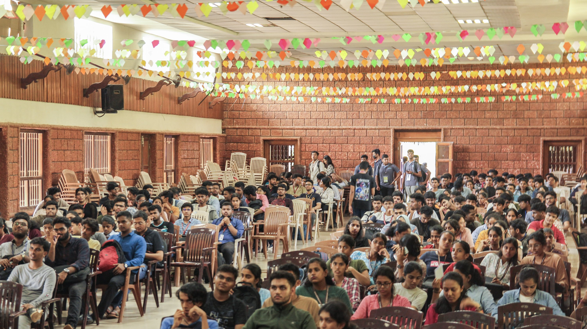
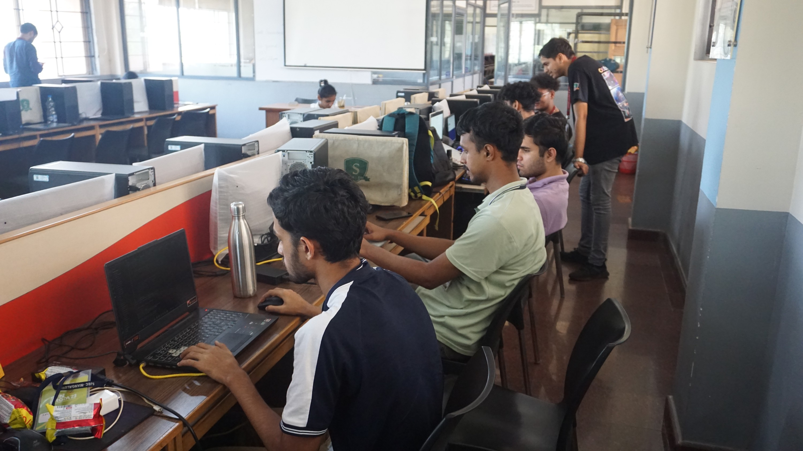
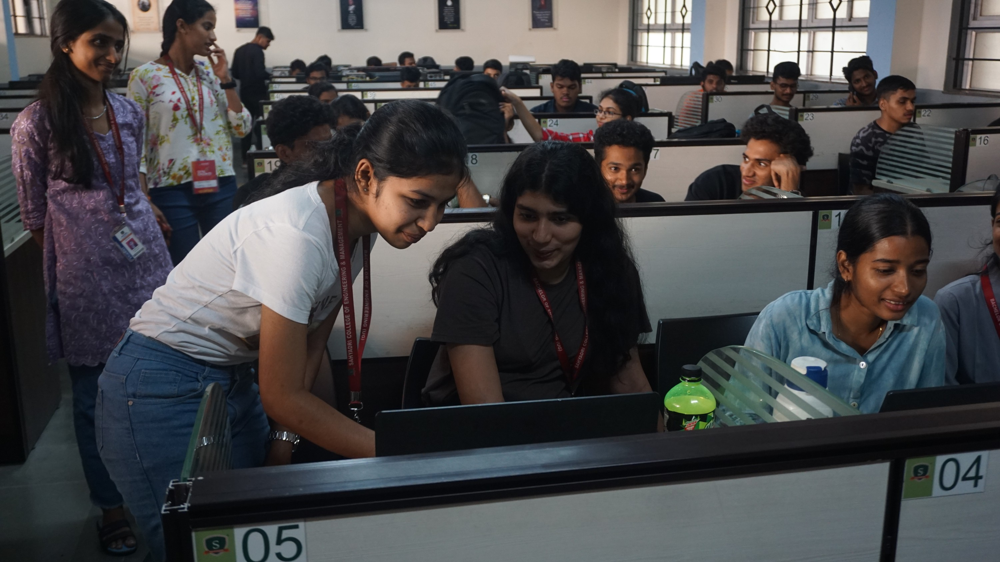
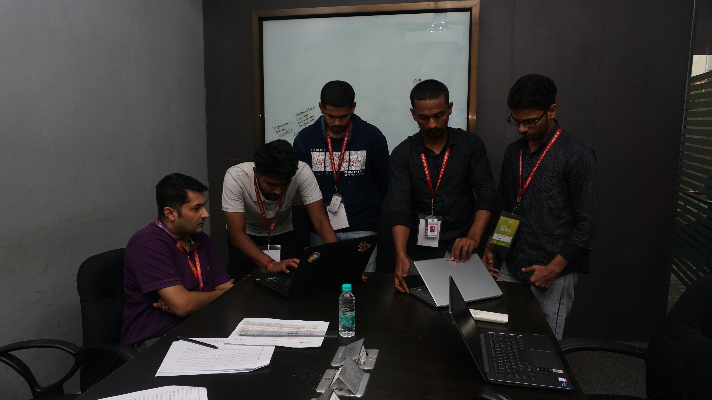
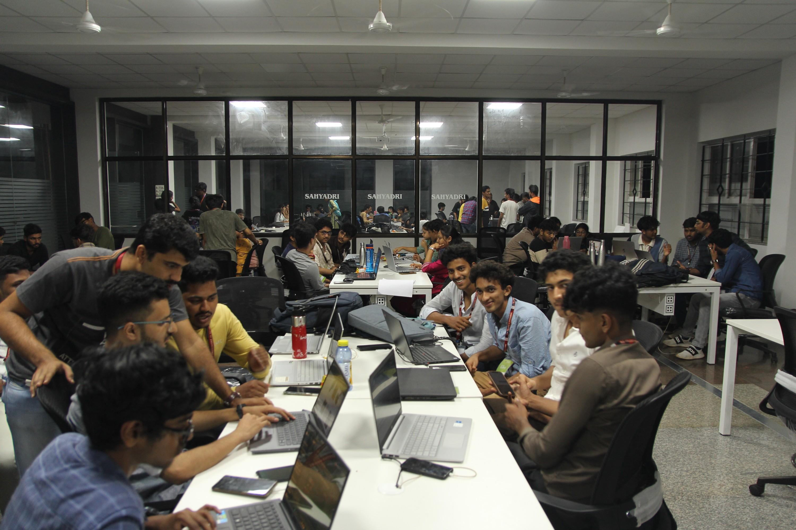

## About the Event

Codeblaze is an extraordinary tech extravaganza, set to be a thrilling event spanning technical and non-technical domains. It aims to empower participants with knowledge and skills while fostering curiosity and innovation. With a variety of tech-focused events, it offers opportunities for growth and self-discovery. Join the 20-hour on-site Hackathon to turn your innovative ideas into reality, with themes suitable for all skill levels.

for more details visit the [codeblaze website](https://codeblaze.sosc.org.in/)

### Event Overview

- Date: December 8th - 9th, 2023
- 300+ participants from across different institutions in India and abroad

## About Hackathon

Participants present projects to judges, with company-funded or open-themed problem statements. Workshops cover tech stacks. Event includes intro, 20-hour hack, and three-phase evaluation: Design, Progress, Presentation. Judges assess approach, idea, business criteria, efficiency, speed, user experience, soft skills, cost, difficulty, and workforce. Final presentation is offline. Themes suit all skill levels.

### Media

